# Modryos

**The mod engine for Minecraft.**

Models, textures, animations, screens, quests and the rules that tie them together, in one desktop
studio. Press Play and the mod opens in the game.

> **Modryos 1.0.0 is coming soon.** This page shows where it stands today. Watch this repository to
> hear when it's out.

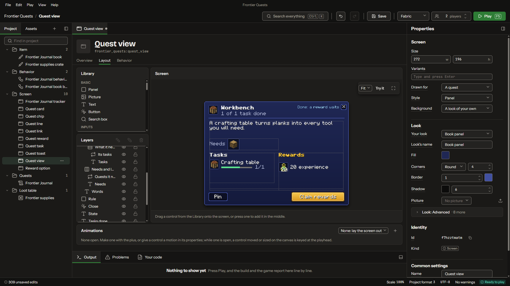

## Build it here, play it there

The screen you lay out in the studio is the screen that opens in the game. Minecraft 1.21.1, on
NeoForge and Fabric, from the same project.

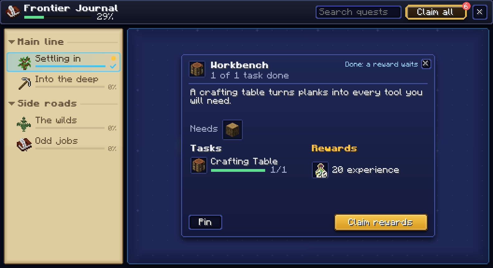

## Models, textures and animations

A block model editor with a live 3D preview, a pixel painter for textures, and a timeline for
animations.

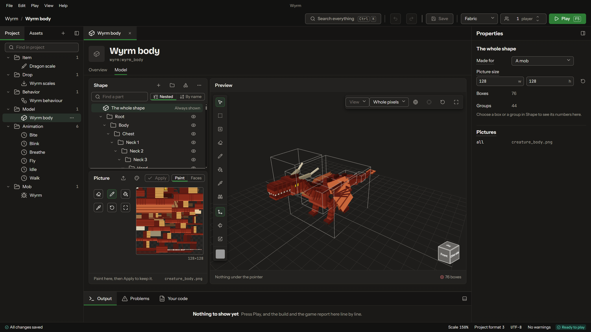

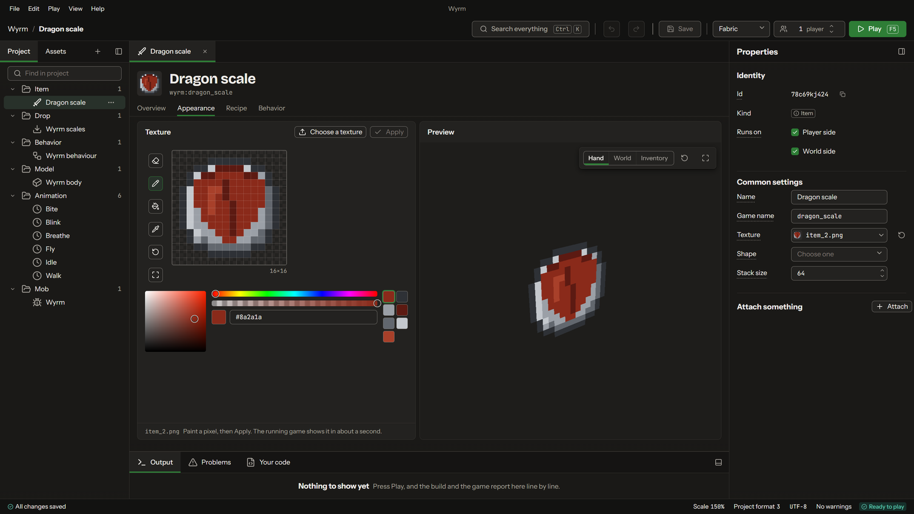

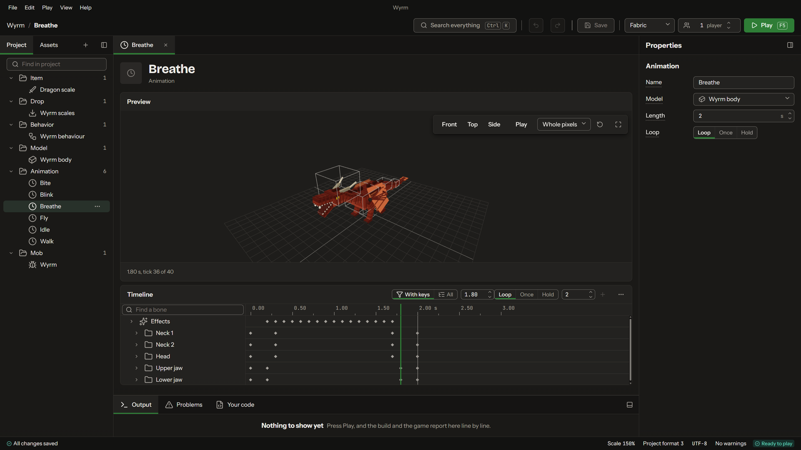

## Screens for any mod

Machine screens, HUD bars, books and quest views. Drag controls onto the screen, give them a look,
and tie them to what the mod knows: a tank's level, a player's mana, the foods they've tasted.

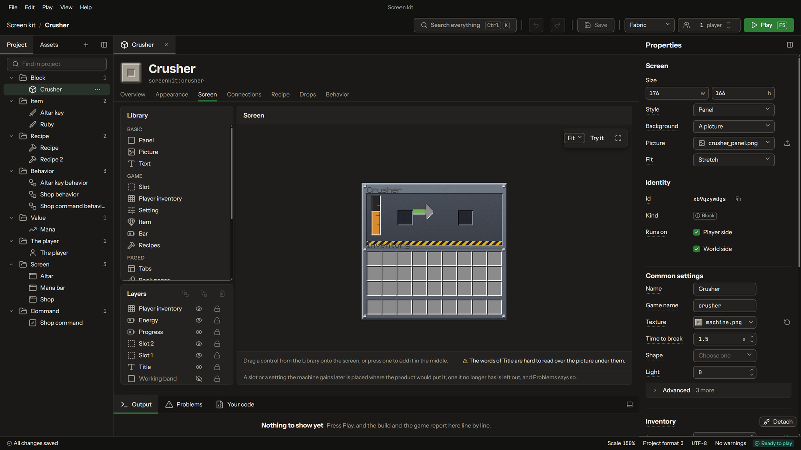

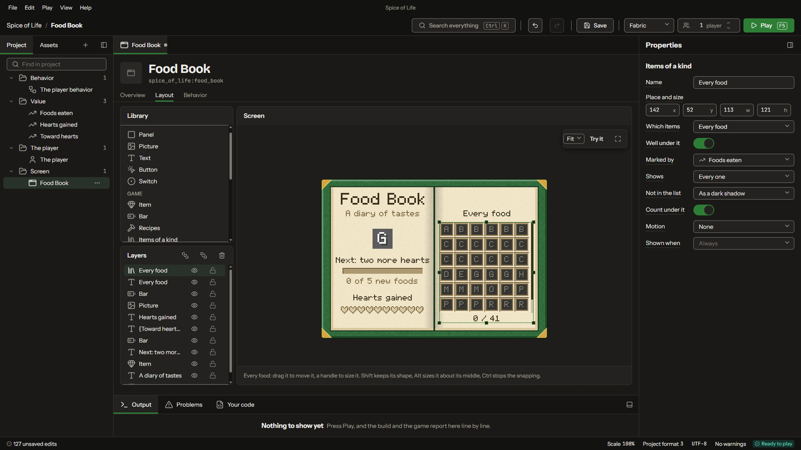

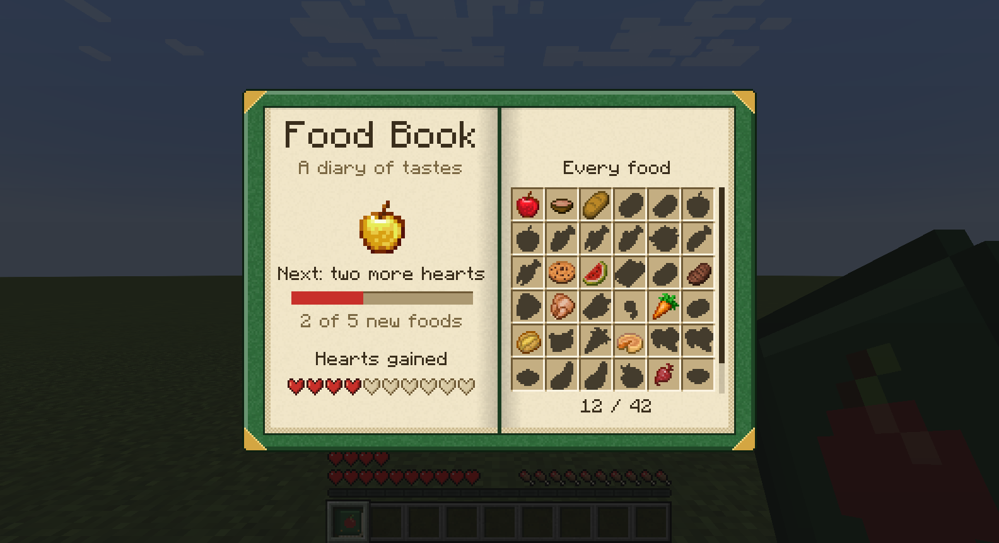

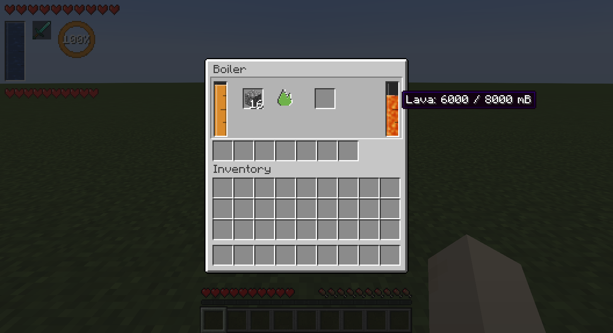

## Rules in sentences, or in Java

Say what happens in sentences you pick from: when the sword hits something, set it on fire, and if
it was a player, warn whoever holds the sword. Conditions nest into groups the way a game engine's visual
scripting does. Each sentence is Java underneath, and the code view is always one click away.

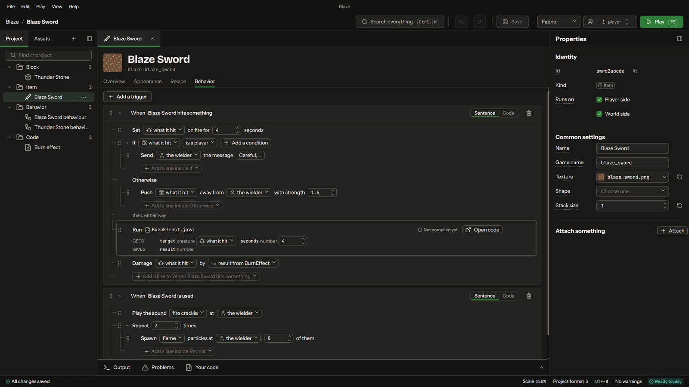

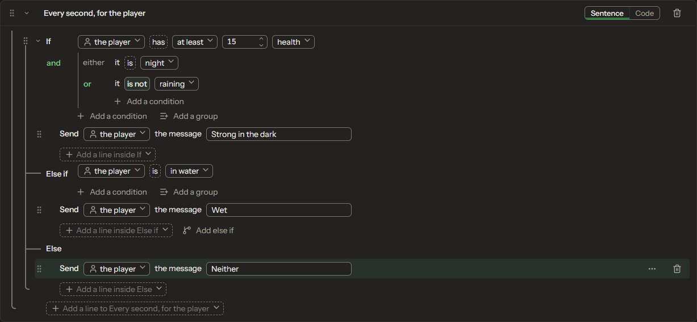

## Quests

Chapters, quests and the lines between them, drawn on a map.

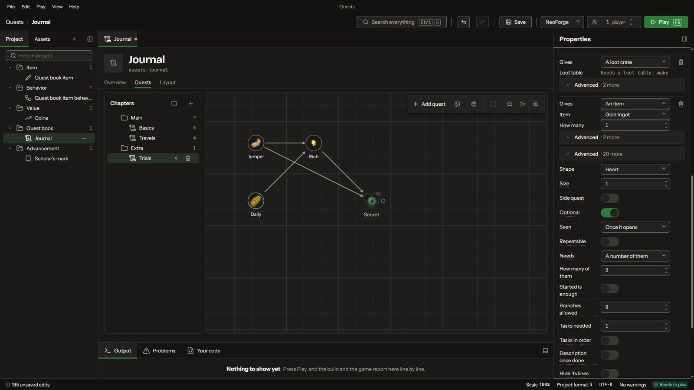

## Every version kept

Save a version, compare any two, and see what changed, element by element.

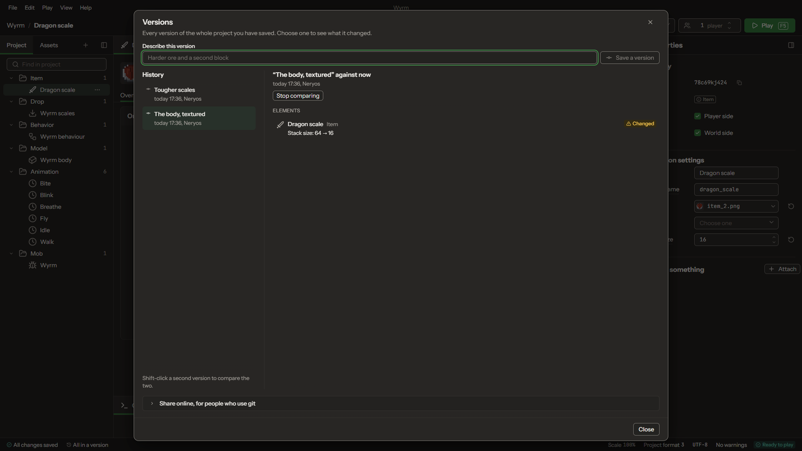

## Where it stands

- Minecraft 1.21.1, NeoForge and Fabric
- 1.0.0 is coming soon
- The first mod made with it: [Goat Apples](https://github.com/NeryosX/goat-apples)

Website: [modryos.com](https://modryos.com)

---

Not an official Minecraft product. Not approved by or associated with Mojang or Microsoft.
